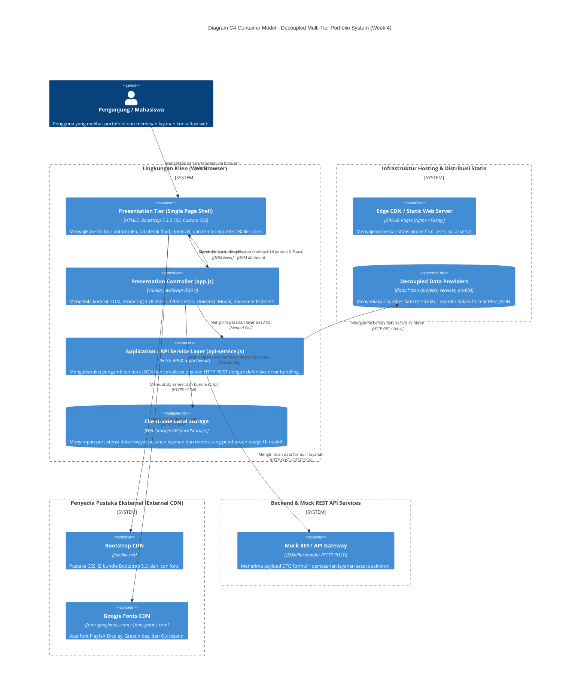
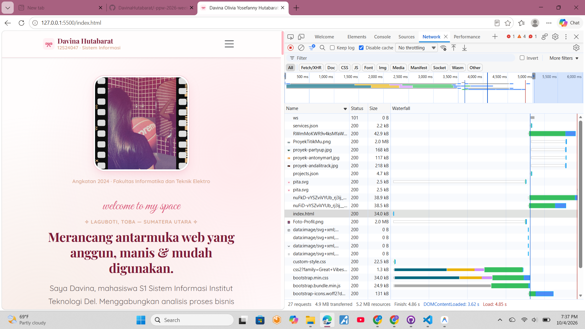
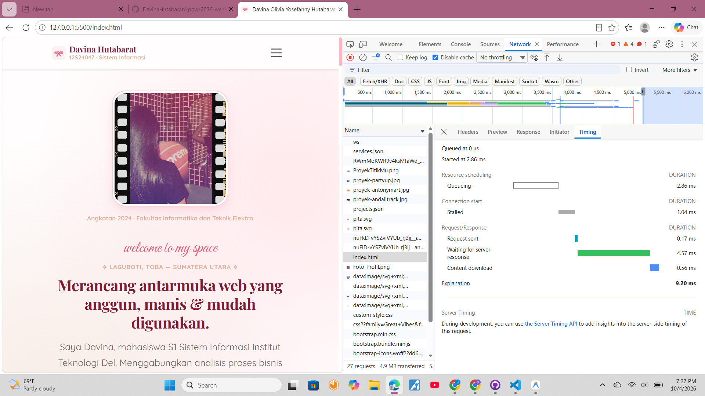
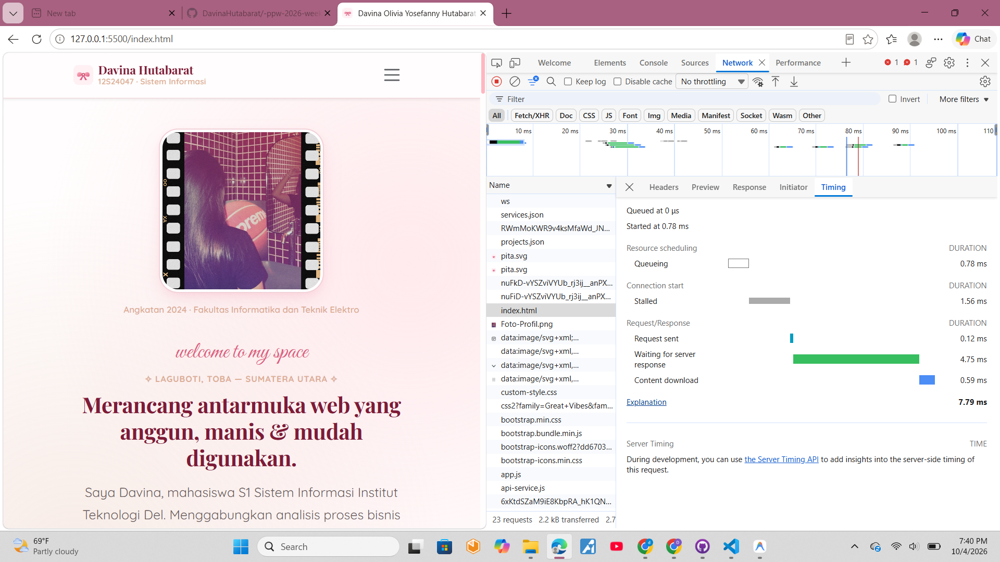
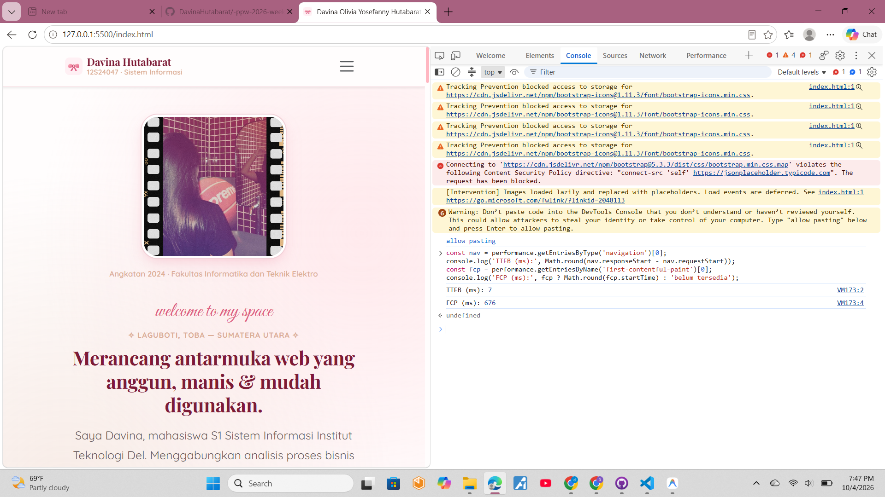
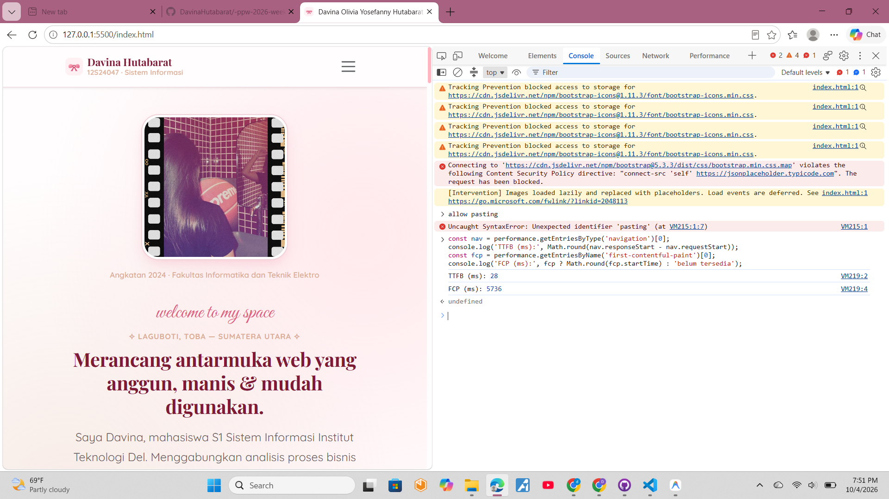
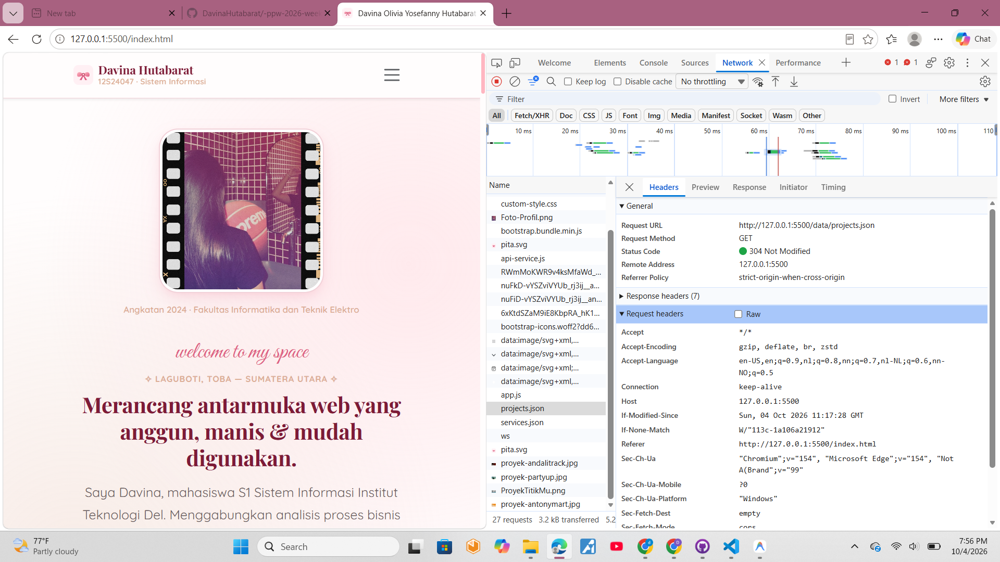

# Portofolio Web & Service Portal — Praktikum Minggu 04
## Arsitektur Aplikasi Web Kontemporer: Decoupled Multi-Tier, Dynamic Client-Side Rendering (CSR), dan Analisis Kinerja Web

Repositori ini memuat hasil refactoring arsitektural menyeluruh pada aplikasi web portofolio profil profesional dan portal layanan konsultasi milik **Davina Olivia Yosefanny Hutabarat**, mahasiswa Program Studi S1 Sistem Informasi Institut Teknologi Del. 

Pembaruan pada Praktikum Minggu 04 ini mentransformasikan arsitektur monolitik statis menjadi arsitektur kontemporer yang **terpisah (decoupled)** dan berbasis **Dynamic Client-Side Rendering (CSR)** dengan pemisahan tanggung jawab (*Separation of Concerns*), integrasi *Universal Dynamic Modal*, penanganan *4 UI States*, pengiriman formulir asinkron *RESTful (JSON DTO)*, persistensi *localStorage* reaktif, kepatuhan *Content Security Policy (CSP)*, serta pengujian profil jaringan berbasis standar *RFC 9111*.

---

## 👩‍💻 Identitas Mahasiswa & Informasi Repositori

| Atribut | Rincian Informasi |
| :--- | :--- |
| **Nama Lengkap** | Davina Olivia Yosefanny Hutabarat |
| **NIM** | 12S24047 |
| **Program Studi** | S1 Sistem Informasi (Angkatan 2024) |
| **Fakultas** | Fakultas Informatika dan Teknik Elektro (FITE) |
| **Institusi** | Institut Teknologi Del |
| **Mata Kuliah** | Pemrograman dan Pengujian Web (12S3101) |
| **Dosen Pengampu** | Chandro Pardede, S.Kom., M.Sc. |
| **Tahun Akademik** | Semester Genap 2025/2026 |
| **Cabang Git (Branch)** | `week4-architecture` |
| **Tautan Live Demo** | [https://davinahutabarat.github.io/-ppw-2026-week2-12S24047/](https://davinahutabarat.github.io/-ppw-2026-week2-12S24047/) |


---

## 🏛️ Pemodelan Arsitektur Sistem: C4 Container Model

Arsitektur aplikasi web ini mengadopsi model **Decoupled Multi-Tier Architecture** yang membagi fungsionalitas sistem ke dalam kontainer-kontainer otonom. Diagram C4 Container Model berikut mengilustrasikan batas sistem (*system boundaries*), protokol komunikasi, serta aliran data antar komponen:



---

## 🔬 Narasi Ilmiah: Separation of Concerns (SoC)

Arsitektur aplikasi web kontemporer memisahkan tanggung jawab fungsional ke dalam tingkatan independen (*Separation of Concerns*). Pemisahan ini meminimalkan keterikatan erat (*tight coupling*) dan memaksimalkan keterpeliharaan kode (*maintainability*), skalabilitas (*scalability*), serta kemampuan pengujian (*testability*):

### 1. Presentation Tier (Client / Browser Antarmuka)
- **Komponen**: `index.html`, `css/custom-style.css`, dan `js/app.js`.
- **Tanggung Jawab**: Bertanggung jawab penuh terhadap persepsi visual, interaktivitas pengguna, responsivitas antarmuka di berbagai ukuran layar, dan manajemen status antarmuka pengguna (*UI States*). 
- **Karakteristik**: File `index.html` hanya berperan sebagai *shell container* kosong tanpa satu pun data kartu proyek hardcoded. Seluruh perakitan elemen visual dijalankan di sisi klien melalui `app.js` yang merender data secara dinamis berdasarkan data model yang diterima.

### 2. Application / Service Logic Tier (Data Access Layer & API Gateway)
- **Komponen**: `js/api-service.js`.
- **Tanggung Jawab**: Bertindak sebagai lapisan perantara (*middleware/abstraction layer*) antara antarmuka pengguna dan penyedia data. Mengelola pembentukan request HTTP asinkron, validasi status respons jaringan (`response.ok`), deserialisasi JSON, serialisasi Data Transfer Object (DTO) untuk transaksi `HTTP POST`, serta penanganan galat terpusat (*defensive error handling*).
- **Karakteristik**: Lapisan ini tidak mengetahui detail elemen DOM apa yang akan dirender (tidak ada ketergantungan pada `document.getElementById` atau selektor HTML), sehingga dapat digunakan kembali (*reusable*) atau diuji secara terisolasi.

### 3. Data Storage Tier (Lapisan Persistensi & Penyedia Data)
- **Komponen**: `data/projects.json`, `data/services.json`, `data/profile.json`, serta Browser `localStorage`.
- **Tanggung Jawab**: Menyediakan dan mempertahankan konsistensi data entitas aplikasi. Direktori `/data` berfungsi sebagai *decoupled mock database* yang menyajikan data terstruktur berbasis JSON murni. Sementara itu, `localStorage` bertindak sebagai *distributed client-side persistent storage* yang menjaga state riwayat pemesanan layanan pengguna agar tidak hilang saat peramban ditutup atau dimuat ulang.

---

## ⚖️ Analisis Komparatif Paradigma Rendering: SSR vs CSR vs Jamstack

Dalam rekayasa web modern, pemilihan paradigma rendering menentukan performa, biaya infrastruktur, dan pengalaman pengguna:

| Parameter Evaluasi | Server-Side Rendering (SSR) | Dynamic Client-Side Rendering (CSR) *(Proyek Ini)* | Jamstack / Decoupled Static |
| :--- | :--- | :--- | :--- |
| **Lokasi Perakitan DOM** | Di Server Aplikasi per HTTP request. Server mengeksekusi template engine dan mengembalikan dokumen HTML utuh. | Di Browser pengguna via mesin JavaScript (V8). Server hanya mengirim HTML shell mini dan berkas data JSON. | Saat proses build (*Build-Time* / SSG) lalu dihidrasi (*hydrated*) secara dinamis via API di browser. |
| **Beban Komputasi Server** | **Tinggi**. Server harus menjalankan CPU runtime (Node.js/PHP/Java) untuk setiap permintaan halaman. | **Sangat Rendah**. Server statis hanya menyalurkan berkas statis (I/O murni) tanpa komputasi template. | **Minimal**. Seluruh aset terkompilasi telah di-cache di seluruh node Edge CDN global. |
| **Time to First Byte (TTFB)** | Menengah hingga Lambat (bergantung pada latensi query database server dan rendering template). | **Sangat Cepat** (< 100ms) karena dokumen HTML shell statis disajikan langsung dari Edge cache. | **Sangat Cepat** (< 50ms) langsung dari titik kehadiran (PoP) CDN terdekat. |
| **Interaktivitas Pengguna** | Kaku. Setiap transisi halaman atau pengiriman formulir memicu *full page reload*. | **Sangat Mulus & Reaktif**. Navigasi instan, pemfilteran data tanpa reload, serta umpan balik Toast/Modal dinamis. | **Sangat Mulus & Cepat**. Menggabungkan kecepatan halaman statis dengan reaktivitas interaktif API. |
| **Infrastruktur Hosting** | Memerlukan server aktif 24/7 (VPS, Docker, Cloud Run, atau PaaS berbayar). | Cukup *Static Web Server* atau *Edge CDN* (GitHub Pages, Cloudflare Pages, Vercel). | Cukup *Static Web Server* + arsitektur microservices / serverless function jika diperlukan. |
| **Keamanan Server** | Rentan terhadap serangan injeksi sisi server (SQL Injection, Remote Code Execution). | Permukaan serangan server minim; fokus keamanan berpindah ke sanitasi masukan DOM-XSS di browser. | Sangat aman; tidak ada basis data aktif atau runtime server aplikasi yang terekspos secara langsung. |

---

## 🔄 Tabel Komparasi: Sebelum vs Sesudah Refactoring

Tabel di bawah ini mendokumentasikan transformasi arsitektural dari implementasi monolitik statis Minggu 02/03 ke arsitektur decoupled multi-tier Minggu 04:

| Komponen & Fitur | Sebelum Refactoring (Minggu 02/03) | Sesudah Refactoring (Minggu 04: Decoupled Multi-Tier) | Peningkatan Teknis & Nilai Arsitektur |
| :--- | :--- | :--- | :--- |
| **Arsitektur Berkas** | Monolitik statis di mana seluruh konten, styling, dan data menyatu dalam file `index.html`. | Decoupled Multi-Tier: folder terpisah `/data` (JSON provider), `/js` (DAL & PL), dan `/css` (theming). | Memenuhi standar *Separation of Concerns* (SoC), modularitas tinggi, dan kemudahan kolaborasi tim pengembang. |
| **Pemuatan Portofolio** | Kartu portofolio ditulis manual secara hardcoded di dalam HTML murni. | Dynamic Client-Side Rendering (CSR) menggunakan `fetch()` asinkron dari `data/projects.json`. | Pembaruan proyek cukup dilakukan pada data JSON tanpa perlu menyentuh markup presentasi HTML. |
| **Manajemen Status UI** | Tidak ada state management. Jika jaringan gagal atau aset hilang, halaman rusak tanpa feedback. | Menangani **4 UI States**: *Loading* (skeleton shimmer), *Success* (kartu proyek), *Empty* (filter nihil), *Error* (alert + tombol coba lagi). | Antarmuka tangguh (*resilient*), memberikan kejelasan status visual bagi pengguna, dan menangani kegagalan jaringan secara defensif. |
| **Pemfilteran Kategori** | Tidak ada filter, atau filter berbasis reload halaman penuh. | Filter kategori dinamis instan di memori peramban tanpa memicu refresh halaman web. | *Instant client-side feedback* yang menghemat transmisi jaringan dan meningkatkan *User Experience* (UX). |
| **Komponen Modal** | 4 elemen dialog modal duplikat yang ditulis terpisah secara redundan di berkas HTML. | **1 Modal Universal Tunggal** (`#universalProjectModal`) yang diinjeksi datanya secara dinamis berdasarkan `data-project-id`. | Menghilangkan redundansi kode HTML hingga 70%, efisiensi DOM tree, dan pemeliharaan antarmuka terpusat. |
| **Pertahanan DOM-XSS** | Rentan terhadap injeksi string mentah jika menggunakan `innerHTML`. | Sanitasi komprehensif menggunakan helper `escapeHTML()` dan pemanfaatan `textContent` untuk manipulasi teks. | *Defense in Depth*: Menutup celah eksploitasi skrip berbahaya dari data eksternal (*CWE-79: Cross-Site Scripting*). |
| **Pengiriman Formulir** | Mengandalkan form action standar yang memicu reload halaman penuh (*full page reload*). | Pengiriman asinkron murni via AJAX/Fetch `POST` dengan serialisasi JSON DTO ke JSONPlaceholder API. | Interaksi modern tanpa kedipan halaman, dilengkapi status tombol submit (spinner + disabled) dan Toast interaktif. |
| **Persistensi State Lokal** | Data pemesanan hilang seketika setelah halaman ditutup atau dimuat ulang. | Data pesanan tersimpan secara terdistribusi di `localStorage` dengan penampil badge pesanan reaktif. | Menyediakan kontinuitas data sesi lokal pengguna tanpa memerlukan infrastruktur basis data kompleks. |

---

## 📊 Analisis Caching Jaringan & Profil Kinerja DevTools (RFC 9111)

Sesuai standar **RFC 9111 (HTTP Caching)**, peramban modern menerapkan hierarki caching berlapis untuk mengeliminasi latensi transmisi jaringan berulang. Mekanisme ini mengombinasikan instruksi validitas lokal (`Cache-Control: max-age`) dan validasi bersyarat (*conditional requests*) menggunakan validator representasi berkas (`ETag` atau `Last-Modified`). 

Ketika aset yang diminta masih berada dalam masa validitas, peramban mengambilnya langsung dari memori atau disk (`(disk cache)` / `(memory cache)`) tanpa mengirim request keluar. Ketika masa validitas kedaluwarsa, browser mengirimkan header `If-None-Match: "<ETag>"`. Jika berkas di server belum berubah, server merespons dengan status **HTTP 304 Not Modified** tanpa menyertakan body konten, menghemat hingga 95% pemakaian bandwidth.

### Tabel Pengukuran DevTools: Cold Load vs Warm Load

> **Petunjuk Mahasiswa (Davina Hutabarat)**:
> 1. Buka halaman GitHub Pages web Anda di Google Chrome.
> 2. Buka DevTools (`F12` atau `Ctrl + Shift + I`), lalu pilih tab **Network**.
> 3. **Pengukuran Cold Load**: Centang opsi *"Disable cache"*, lakukan reload penuh (`Ctrl + F5` atau `Ctrl + Shift + R`), dan catat metrik pada baris Cold Load.
> 4. **Pengukuran Warm Load**: Hapus centang *"Disable cache"*, tekan tombol reload biasa (`F5`), dan catat metrik pada baris Warm Load.
> 5. Masukkan angka hasil pengukuran aktual Anda ke dalam tabel di bawah ini untuk menggantikan teks placeholder.

| Metrik Evaluasi Kinerja | Cold Load (Disable Cache / Bersih) | Warm Load (Cache Aktif / Muat Ulang) | Analisis Efisiensi & Standar RFC 9111 |
| :--- | :--- | :--- | :--- |
| **Time to First Byte (TTFB)** | <!-- [Isi hasil ukur Anda, mis: 42 ms] --> | <!-- [Isi hasil ukur Anda, mis: 8 ms / 0 ms] --> | Penurunan TTFB pada warm load menunjukkan eliminasi DNS lookup dan handshake TLS. |
| **First Contentful Paint (FCP)** | <!-- [Isi hasil ukur Anda, mis: 0.6 s] --> | <!-- [Isi hasil ukur Anda, mis: 0.2 s] --> | Konten awal dirender jauh lebih cepat karena berkas stylesheet CSS diambil dari cache lokal. |
| **Total Permintaan Jaringan (Requests)** | <!-- [Isi hasil ukur Anda, mis: 14 requests] --> | <!-- [Isi hasil ukur Anda, mis: 14 requests] --> | Jumlah request identik, namun jalur transfer aset berpindah ke internal memory/disk. |
| **Ukuran Data Ditransfer (Transferred)** | <!-- [Isi hasil ukur Anda, mis: 1.8 MB] --> | <!-- [Isi hasil ukur Anda, mis: 2.4 KB (disk cache)] --> | Penghematan bandwidth drastis karena aset berukuran besar tidak diunduh ulang. |
| **Ukuran Total Sumber Daya (Resources)** | <!-- [Isi hasil ukur Anda, mis: 2.1 MB] --> | <!-- [Isi hasil ukur Anda, mis: 2.1 MB] --> | Total representasi data tetap utuh dan didekompresi di memori browser. |
| **Waktu Selesai (DOMContentLoaded)** | <!-- [Isi hasil ukur Anda, mis: 480 ms] --> | <!-- [Isi hasil ukur Anda, mis: 120 ms] --> | Parsing struktur DOM selesai jauh lebih singkat karena parser tidak terblokir unduhan eksternal. |
| **Waktu Pemuatan Penuh (Load Time)** | <!-- [Isi hasil ukur Anda, mis: 850 ms] --> | <!-- [Isi hasil ukur Anda, mis: 210 ms] --> | Pengalaman interaktivitas instan yang dirasakan langsung oleh pengguna akhir. |
| **Status HTTP Dominan** | `200 OK` (Transferred over network) | `304 Not Modified` / `200 OK (from disk cache)` | Membuktikan efektivitas header validasi `ETag` dan `If-None-Match`. |

---

### Tangkapan Layar Waterfall DevTools Network Tab

Berikut adalah rekaman visual analisis waterfall jaringan yang diperoleh dari DevTools:

#### 1. Waterfall Jaringan - Cold Load (Cache Disabled)



#### 2. Waterfall Jaringan - Warm Load (Repeated Visit / Cache Hit)


### 1. Ringkasan Cold Load vs Warm Load

| Metrik | Cold Load | Warm Load | Perubahan |
|---|---|---|---|
| TTFB `index.html` (tab Timing) | 4.57 ms | 4.75 ms | Hampir sama |
| First Contentful Paint (FCP) | 5736 ms | 676 ms | Turun ± 88% |
| Jumlah request | 27 | 23 | -4 |
| Data transferred | 4.9 MB | 2.2 kB | Turun ± 99,95% |
| Resources | 5.2 MB | 2.7 MB | -2.5 MB |
| DOMContentLoaded | 3.62 s | 76 ms | Turun ± 98% |
| Load | 4.85 s | 78 ms | Turun ± 98% |
| Finish | 4.86 s | 89 ms | Turun ± 98% |
| Status `index.html` | 200 OK | 304 Not Modified | Divalidasi via ETag |

### 2. Efisiensi Caching per Berkas (Ukuran Transfer)

| Berkas | Cold (200) | Warm | Keterangan |
|---|---|---|---|
| `index.html` | 34.0 kB | 304, 243 B | Revalidasi ETag |
| `css/custom-style.css` | 22.5 kB | 304, 243 B | Revalidasi ETag |
| `js/app.js` | 20.4 kB | 304, 243 B | Revalidasi ETag |
| `js/api-service.js` | 2.9 kB | 304, 242 B | Revalidasi ETag |
| `data/projects.json` | 4.7 kB | 304, 243 B | Revalidasi ETag |
| `data/services.json` | 2.2 kB | 304, 242 B | Revalidasi ETag |
| `Foto-Profil.png` | 2.0 MB | 304, 245 B | Penghematan terbesar |
| Bootstrap, Bootstrap Icons, Google Fonts (CDN) | 200 (diunduh) | 200, 0 B | Dilayani dari memory/disk cache browser |

### 3. Header Caching `index.html` (Response Headers)

| Header | Nilai | Arti |
|---|---|---|
| `Cache-Control` | `public, max-age=0` | Boleh disimpan, tetapi wajib divalidasi ke server setiap kali dipakai |
| `ETag` | `W/"7dc1-1a106a3e632"` | Sidik jari berkas untuk validasi (`If-None-Match`) |
| `Last-Modified` | `Sun, 04 Oct 2026 11:19:27 GMT` | Waktu modifikasi terakhir berkas |
| Status Warm Load | `304 Not Modified` | Body kosong, hanya ± 243 B yang ditransfer |

### 4. Bukti Screenshot

| Cold Load | Warm Load |
|---|---|
|  |  |
|  |  |
|  |  |

**Bukti status 304 dan header caching:**



### 5. Analisis

- **Cold Load** membutuhkan 4.85 s dan 4.9 MB. Sebagian besar ukuran berasal dari dua gambar PNG
  berukuran 2.0 MB (`Foto-Profil.png`, `ProyekTitikMu.png`). Waktu tunggu terlama berasal dari
  aset CDN eksternal (Google Fonts, Bootstrap), bukan dari berkas JSON.
- **Warm Load** menurunkan data transfer menjadi 2.2 kB karena berkas lokal divalidasi dengan
  ETag dan dijawab `304 Not Modified`, sedangkan aset CDN dilayani langsung dari cache browser.
- **TTFB tidak membaik** karena `Cache-Control: max-age=0` mewajibkan browser bertanya ke server
  setiap kali. Penghematan berasal dari tidak diunduhnya isi berkas, bukan dari waktu tunggu server.
- **Data layer JSON sangat ringan** (`projects.json` 4.7 kB, `services.json` 2.2 kB, masing-masing
  3-5 ms), sehingga pemisahan data dari HTML tidak menambah beban jaringan yang berarti.
- **Rekomendasi:** kompres gambar ke WebP/JPG (target < 200 kB), serta atur `Cache-Control: max-age`
  yang lebih panjang untuk aset statis pada hosting produksi.
---

## 🛡️ Keamanan Sisi Klien Lapis Pertama (Client-Side Defense in Depth)

### 1. Pencegahan DOM-based Cross-Site Scripting (XSS)
Arsitektur Client-Side Rendering memiliki risiko celah keamanan *DOM-based XSS* apabila string yang bersumber dari penyedia data eksternal diinjeksikan secara mentah ke dalam `.innerHTML`. Aplikasi ini menerapkan prinsip *Defense in Depth* melalui 2 mekanisme:
- **Pembersihan Entitas HTML (`escapeHTML`)**: Seluruh nilai teks, deskripsi, thumbnail URL, dan kategori disaring sebelum dirangkai ke dalam template string:
  ```javascript
  escapeHTML(str) {
    if (str === null || str === undefined) return '';
    return String(str)
      .replace(/&/g, '&amp;')
      .replace(/</g, '&lt;')
      .replace(/>/g, '&gt;')
      .replace(/"/g, '&quot;')
      .replace(/'/g, '&#039;');
  }
  ```
- **Pemberian Teks Murni (`textContent`)**: Pada elemen kritis seperti judul modal universal dan kategori modal, aplikasi menggunakan properti `.textContent` bawaan DOM API yang secara otomatis memperlakukan input sebagai plain text tanpa diparsing sebagai markup HTML.

### 2. Implementasi Content Security Policy (CSP)
Pada berkas `index.html`, diterapkan direktif Content Security Policy melalui elemen `<meta>` untuk membatasi domain asal sumber daya yang boleh dieksekusi oleh peramban:
```html
<meta http-equiv="Content-Security-Policy" content="
  default-src 'self'; 
  script-src 'self' 'unsafe-inline' https://cdn.jsdelivr.net; 
  style-src 'self' 'unsafe-inline' https://cdn.jsdelivr.net https://fonts.googleapis.com; 
  font-src 'self' https://fonts.gstatic.com https://cdn.jsdelivr.net; 
  img-src 'self' data: https:; 
  connect-src 'self' https://jsonplaceholder.typicode.com;
">
```
- `default-src 'self'`: Membatasi seluruh muatan default hanya dari domain asal web.
- `script-src` & `style-src`: Mengizinkan skrip dan stylesheet lokal serta CDN resmi jsDelivr dan Google Fonts.
- `connect-src 'self' https://jsonplaceholder.typicode.com`: Mengizinkan pemanggilan `fetch()` ke endpoint lokal dan server mock API eksternal untuk pengiriman formulir DTO, serta memblokir koneksi liar ke domain yang tidak terdaftar.

---

## 📁 Struktur Direktori Terstandarisasi (Week 4)

Struktur repositori telah disusun persis sesuai ketentuan baku modul praktikum:

```
ppw-2026-week2-12S24047/
├── index.html              # Shell HTML5 & Bootstrap 5 bersih tanpa hardcoded cards
├── css/
│   └── custom-style.css    # Custom styles, theming Coquette, dan CSS variables (Zero !important)
├── data/
│   ├── profile.json        # Biodata pengembang & statistik performa akademik
│   ├── projects.json       # Koleksi data portofolio lengkap (metrics, tags, image, link)
│   └── services.json       # Katalog paket layanan, fitur, dan tarif konsultasi
├── js/
│   ├── api-service.js      # Data Access Layer: Pemanggilan HTTP Fetch & Error Handling
│   └── app.js              # Presentation Layer: Kontrol DOM, Dynamic CSR & Event Handlers
├── docs/
│   ├── waterfall-cold.png  # Bukti tangkapan layar DevTools Network Waterfall (Cold Load)
│   ├── waterfall-warm.png  # Bukti tangkapan layar DevTools Network Waterfall (Warm Load)
│   ├── fcp-cold.png
│   ├── fcp-warm.png  
│   ├── headers-304.png
│   ├── timing-warm.png
│   └── TTFB index.html untuk Cold Load.png
└── README.md               # Dokumentasi C4 Container Model, komparasi arsitektur & DevTools
```

---

## 💻 Panduan Menjalankan Proyek Secara Lokal

> [!IMPORTANT]
> **Penting**: Aplikasi web ini menggunakan `fetch()` asinkron untuk mengambil berkas JSON lokal. Karena kebijakan keamanan peramban (*Same-Origin Policy* dan pembatasan CORS pada skema URL `file:///`), membuka berkas `index.html` dengan cara klik ganda biasa akan memicu error:
> `Cross-Origin Request Blocked: The Same Origin Policy disallows reading the remote resource at file:///...`
> Oleh karena itu, aplikasi **wajib dijalankan melalui web server lokal**.

### Opsi 1: Menggunakan Ekstensi VS Code Live Server (Direkomendasikan)
1. Buka folder repositori ini di **Visual Studio Code**.
2. Pasang ekstensi **Live Server** (oleh *Ritwick Dey*) melalui tab Extensions (`Ctrl + Shift + X`).
3. Klik kanan pada berkas `index.html` lalu pilih **"Open with Live Server"**, atau klik tombol **"Go Live"** di status bar kanan bawah VS Code.
4. Halaman akan terbuka otomatis pada peramban di alamat `http://127.0.0.1:5500/index.html`.

### Opsi 2: Menggunakan Node.js (`npx serve`)
Jalankan perintah berikut di terminal repositori:
```bash
npx serve .
```
Aplikasi akan tersedia pada `http://localhost:3000`.

### Opsi 3: Menggunakan Python HTTP Server
Jika Anda memiliki Python terpasang di komputer:
```bash
python -m http.server 8000
```
Buka browser pada alamat `http://localhost:8000`.


---

## 🚀 Panduan Pengelolaan Git & Pengaktifan GitHub Pages

Untuk mempublikasikan pembaruan arsitektural ini ke repositori jarak jauh dan mengaktifkan GitHub Pages:

### 1. Komit Pembaruan pada Cabang `week4-architecture`
Pastikan Anda berada pada cabang `week4-architecture`:
```bash
# Periksa status berkas
git status

# Tambahkan seluruh perubahan berkas
git add .

# Buat komit dengan format terstandarisasi
git commit -m "feat(week4): decouple architecture to json data providers and async CSR"

# Dorong cabang ke remote GitHub
git push -u origin week4-architecture
```

### 2. Mengaktifkan Deployment GitHub Pages
1. Buka peramban dan navigasikan ke repositori Anda di GitHub:
   `https://github.com/DavinaHutabarat/-ppw-2026-week2-12S24047`
2. Klik menu **Settings** di bilah navigasi atas repositori.
3. Pada bilah sisi kiri (*sidebar*), klik menu **Pages** di bawah kelompok *Code and automation*.
4. Pada bagian **Build and deployment > Source**:
   - Pilih opsi: **Deploy from a branch**.
   - Pilih Branch: **`week4-architecture`** (atau `main` jika telah digabungkan).
   - Pilih Folder: **`/ (root)`**.
5. Klik tombol **Save**.
6. Tunggu sekitar 1 hingga 2 menit hingga proses build selesai. Halaman web akan dapat diakses secara publik pada URL:
   👉 **[https://davinahutabarat.github.io/-ppw-2026-week2-12S24047/](https://davinahutabarat.github.io/-ppw-2026-week2-12S24047/)**

---

*Disusun oleh Davina Olivia Yosefanny Hutabarat (12S24047) untuk memenuhi tugas praktikum Minggu 04 mata kuliah Pemrograman dan Pengujian Web (12S3101), Program Studi Sarjana Sistem Informasi, Institut Teknologi Del, 2026.*
